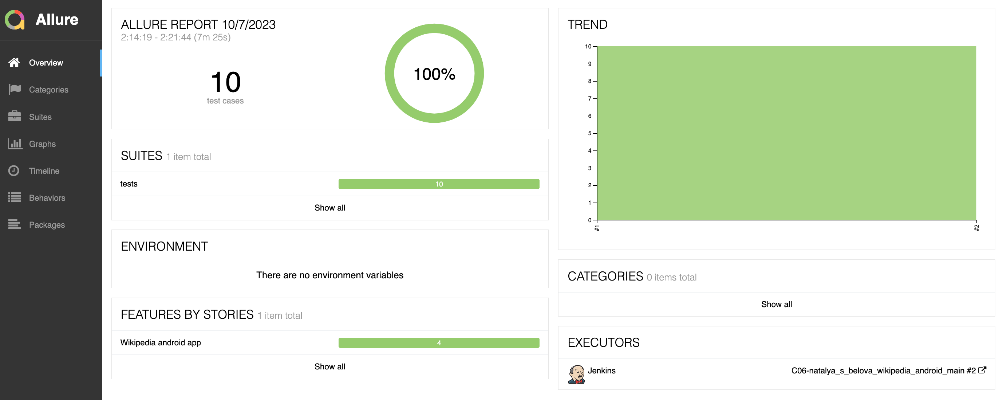
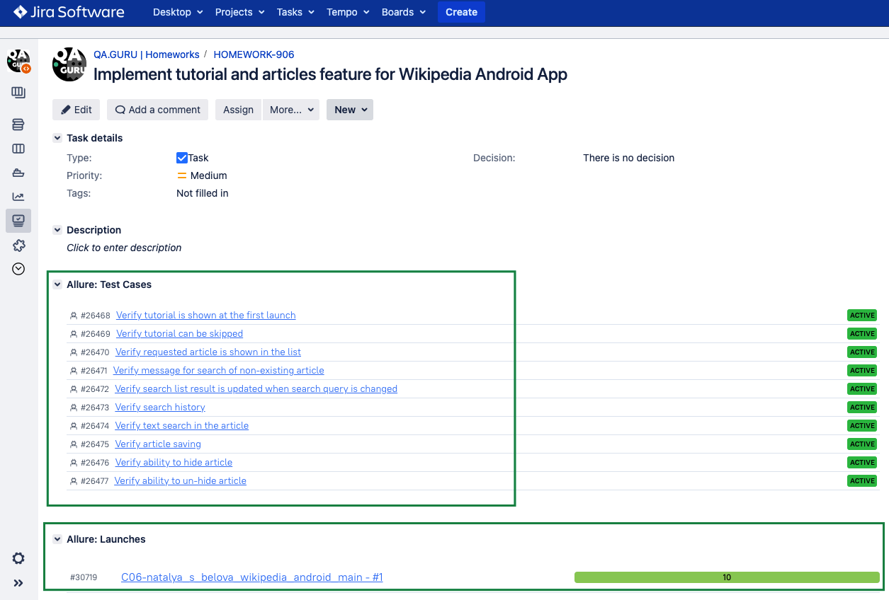

## Training project with autotests for Wikipedia Android [mobile application](https://github.com/wikimedia/apps-android-wikipedia/releases/download/latest/app-alpha-universal-release.apk)
&nbsp;

### Tools and technologies used

### Test coverage
1. Tutorial at the first launch:
   * is shown and has valid content
   * can be skipped
2. Article's:
   * search
   * opening 
   * search history
   * saving
   * hiding

Example of test's running (tutorial content's verifying):

&nbsp;

### Test Launch
Tests are launching using Jenkins service.
To run tests, open the [configured job](https://jenkins.autotests.cloud/job/C06-natalya_s_belova_wikipedia_android_main/) and click 'Build now'.

&nbsp;

Also, since the integration with Allure Test Ops is implemented, it is possible to run tests with this service. 
In Allure Test Ops is also an additional ability to configure test scope by choosing specific test cases.

&nbsp;

### Test Report and Test Documentation

Reporting is implemented using Allure services.

[Allure Report](https://jenkins.autotests.cloud/job/C06-natalya_s_belova_wikipedia_android_main/allure/) can be opened on Jenkins page (see screenshot above) and contains graphics, detalization of test executions, different kinds of attachments (logs, screenshots, videos, etc.).
&nbsp;
&nbsp;

Allure Test Ops also contains such information and in addition it has generated Test Documentation that can be imported to Jira.
&nbsp;
&nbsp;

### Integration with Jira

Test Launches and Test Cases are integrated with Jira Task:
&nbsp;

### Test Results Notifications
As soon as Test Launch is completed, telegram message with the following information is sent:
* total amount of tests and run duration
* percentage of passed/failed/skipped/etc. tests
* link to the allure report

&nbsp;

In order for such messages to be sent, [notifications library](https://github.com/qa-guru/allure-notifications) was used, telegram bot was created and added to a specific telegram group.

### Configuration information

Configuration of this project allows tests to be run on BrowserStack/Local real Device/Local Emulator.

Below is the short information related to local runs.

#### Pre-requisites:
* Install python3, allure report (requires java), git.
* Close this repository, install and activate virtual environment
~~~
git clone https://github.com/natalia-s-belova/wikipedia_android_app_tests
python -m venv .venv
source .venv/bin/activate      # for MacOS
sourse .venv\Scripts\activate          # for Windows
pip install -r requirements.txt
~~~

#### For run on browserstack:
1. Have an account on browserstack 
2. Configure .env.credentials file according to the information provided from browserstack (remove '.example)
3. Upload [wikipedia.apk](https://github.com/wikimedia/apps-android-wikipedia/releases/download/latest/app-alpha-universal-release.apk) file to browserstack and use the result link in 'app' parameter in the next step
4. Configure .env.bstack file according to way you are going to run tests ('android_device', 'android_version' and 'app' are mandatory, other fields can be left as is)
5. Run test in terminal using command 
~~~
context=bstack pytest
~~~

#### For local run:
1. Put the [wikipedia.apk](https://github.com/wikimedia/apps-android-wikipedia/releases/download/latest/app-alpha-universal-release.apk) to the root folder of the project 
2. Install and run emulator/connect to PC and configure real device
3. Install Java SDK, Appium server
4. Start appium server using command 
~~~
appium
~~~ 
5. Configure .env.local_<> file according to way you are going to run tests
6Run test in terminal using command 
~~~
context=local_real pytest
~~~
or
~~~
context=local_emulator pytest
~~~
6. After tests are completed, create allure report by command for MacOS:
~~~
allure serve
~~~

for Windows:
~~~
allure.bat serve
~~~
As a result, you would get Allure report with the same content as demonstrated above.
You can close it by pressing Ctrl+C.
